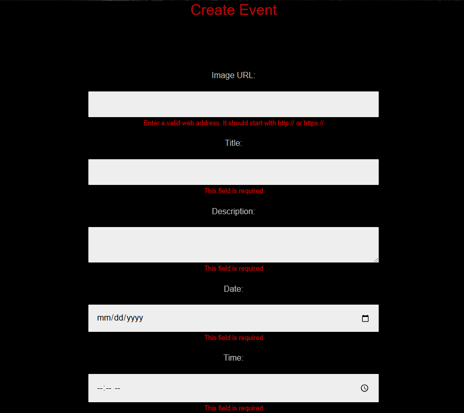

# Doom
1. Easy run the app with Docker:
    Just run in the terminal the command `docker-compose up --build`    

2. Features:
    - Log In, Register, Log Out
    - Only superusers can create site admins
    - Site admins can add, edit and delete services and events
    - Each user receives a welcome message and can send a message to the creator of the app (me) using the contact form

NEW!!!
The database uses your port 5433, so it will not have conflict with your existing PosgreSQL databases (if any).
There is a file all_tables_data.sql with sample data for the app, so you can see it in action.There is a superadmin user as well as admin users, events and services, so you won't have to fill data by yourself. Just run this command in the terminal and make sure your db server is running before doing this.
Make sure you have postgreSQL installed on your machine.
`psql -U postgres -h localhost -p 5433 -d doom_db -f all_tables_data.sql`

3. Screenshots

